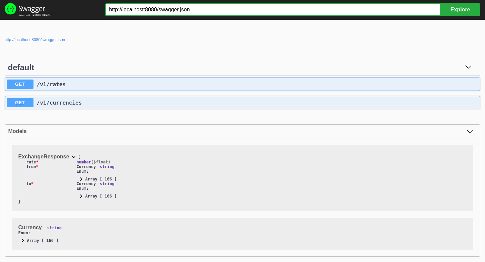

#  exchange-rates

[](https://circleci.com/gh/gvolpe/exchange-rates)

Querying a [rate-limited foreign currency exchange API](https://free.currencyconverterapi.com/) using [Redis](https://redis.io/) as a cache.

- Number of Requests per Hour: 100

### Http Endpoints

#### GET /v1/currencies

Returns a list of the available currencies. Eg:

```json
["USD","EUR","GBP","AUD","CAD","PLN","ARS"]
```

#### GET /v1/rates?from=EUR&to=USD

Returns the current exchange rate, if available:

```json
{"to":"GBP","from":"USD","rate":0.794065}
```

### Run it locally

You'll need a Redis instance. The easiest way to get started is by using `docker`:

```
docker run -p 6379:6379 redis:5.0.0
```

And then run the web server app using `cabal new-run exchange-rates`, you should see something like:

```
AppConfig {forex = ForexConfig {host = "https://free.currconv.com/api/v7", apiKey = [SECRET], keyExpiration = 1800}, redis = RedisConfig {redisHost = "127.0.0.1", redisPort = 6379}}
Started server on localhost:8080
Calling web service for: USD -> GBP
Calling web service for: USD -> EUR
Cache hit: USD -> GBP
Calling web service for: USD -> PLN
Cache hit: USD -> PLN
```

Exchange rates are cached to avoid hitting the (limited) external service many times.

### Browse the documentation

The docs are generated at compile time from the API definition. The API serves a `swagger.json` response that you can visualize in the Swagger UI:

```
docker run -p 80:8080 swaggerapi/swagger-ui
```

Go to `localhost` and enter `http://localhost:8080/swagger.json`.


